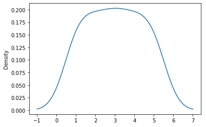
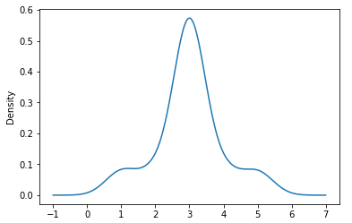

# LibraryCMS

Recommendation system for [Library CMS](https://github.com/dosadczuk/library-cms-backend)

## Requirements

* Pandas
* surprise
* sqlalchemy
* psycopg2

---

## About

This is proof of concept for recommendation system for Library CMS. \
The engine is based on SVD algorithm. Recommendations are based on books borrows and book ratings of users (Fig.1). \

<figcaption><b>Fig.1 - Example recommendations</b></figcaption>

Book ratings are necessary to create predictions(Fig.2). Borrows without rating as a rating value have mean of all raitngs. Beceause of this they are taken into a count during predictions (Fig.3). \
\

<figcaption><b>Fig.2 - Normal distibution of ratings</b></figcaption>

<figcaption><b>Fig.3 - Normal distibution of ratings with borrows</b></figcaption> 

TOP 10 queries were added to create rankings.